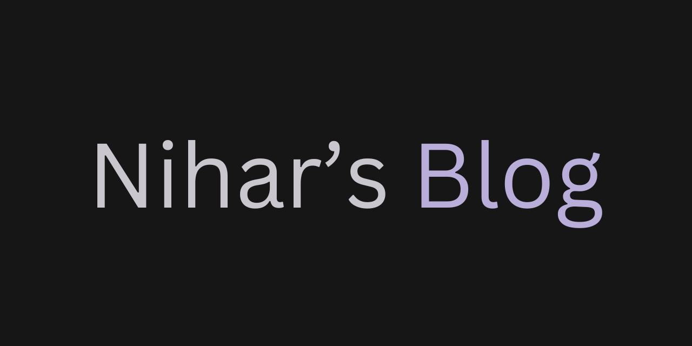

Blog site built with th [Astro](https://astro.build/) and the [Astro Theme Cactus](https://github.com/chrismwilliams/astro-theme-cactus) template.

## Build & Run Locally

Clone the repository.
Replace pnpm with your choice of npm / yarn

| Command          | Action                                                         |
| :--------------- | :------------------------------------------------------------- |
| `pnpm install`   | Installs dependencies                                          |
| `pnpm dev`       | Starts local dev server.                    |
| `pnpm build`     | Build your production site to `./dist/`                        |

## License

MIT
